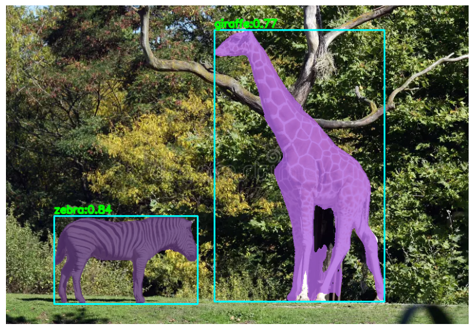
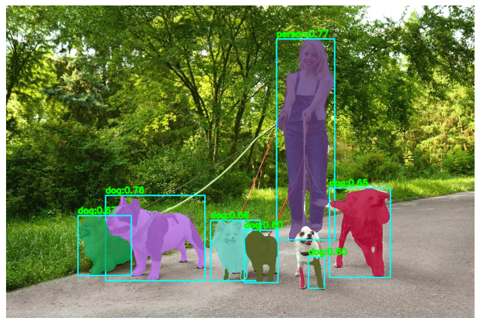
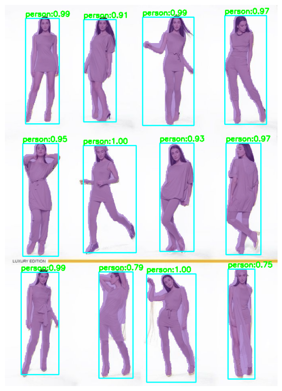
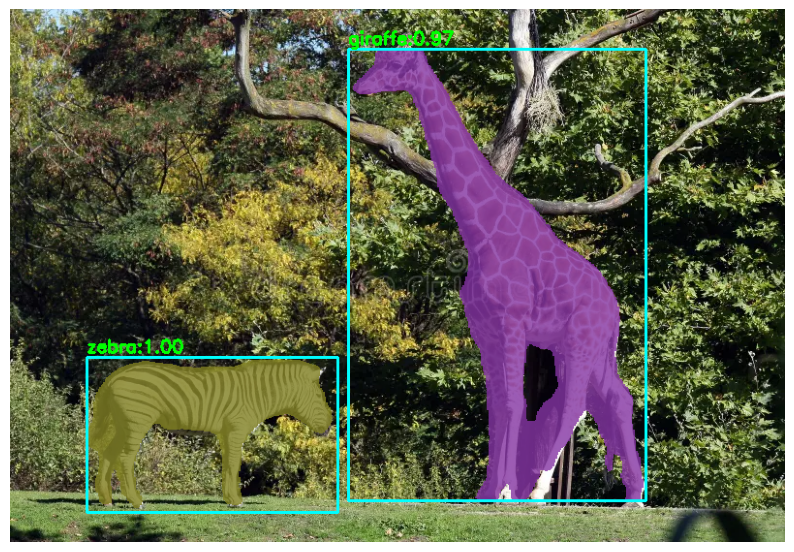
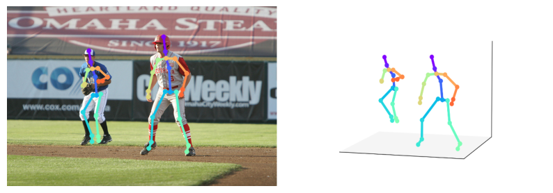
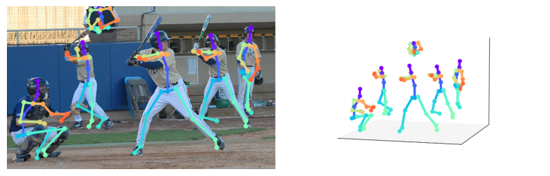
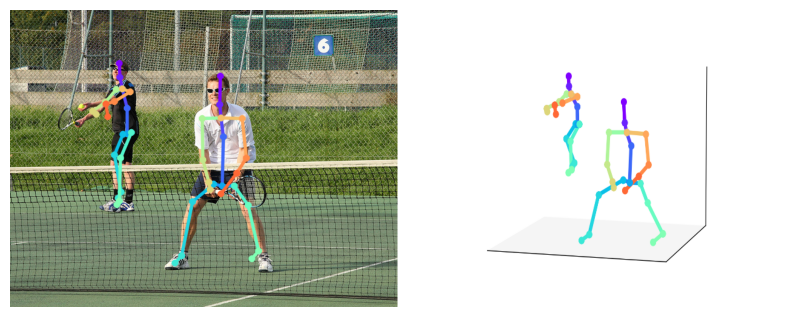
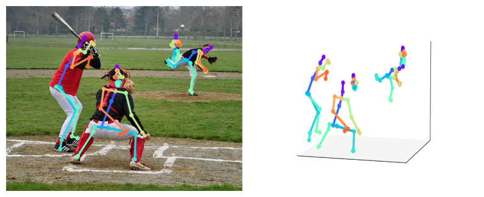
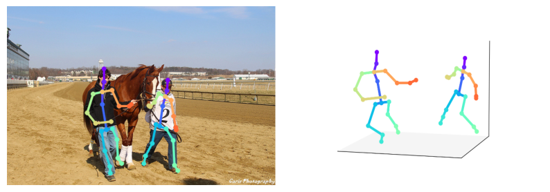

    <h1>3D Pose Estimation using Mobile Human Pose   with YOLACT in onnx </h1>

    <h3>SparseInst vs. YOLACT </h3>

   

    <h3>Mobile Human Pose 3D Pose Estimation </h3>

  

     

---

## 🏗️ Methodology

- 🤾‍♂️🏌🏾‍♂️ 3D Pose Estimation Model: **mobile_human_pose_256x256.onnx**
- 🤾‍♂️🏌🏾‍♂️ Type: **Top-down**
- 🦓🦒 Instance Segmentation Model1: **yolact_550x550_opt.onnx**
- 🚶🏻‍♀️🦮 Instance Segmentation Model2: **sparseinst_r50_giam_aug_768x1344_opt.onnx**
- 🤾‍♂️🏌🏾‍♂️ Framework: **onnxruntime**

---

## ⭐ Acknowledgements

- onnxruntime

---
